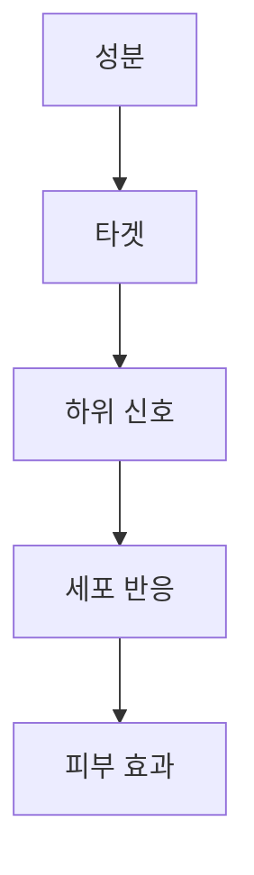

# Ingredient Deep-Dive Skill

Hero 성분에 대한 K-Dense 수준의 심층 분석 리포트 생성 스킬

## Overview

**Ingredient Deep-Dive**는 화장품 제품의 핵심 성분(Hero Ingredient)에 대해 3페이지 이상의 전문적인 심층 분석을 생성하는 스킬입니다. K-Dense 기술 보고서 수준의 깊이와 품질을 목표로 합니다.

### Deep-Dive 분석의 특징

- **과학적 근거 기반**: PubMed, 학술 문헌 기반 정보
- **메커니즘 중심**: 단순 효능 나열이 아닌 작용 기전 설명
- **처방 실무 연계**: 실제 제품 개발에 활용 가능한 정보
- **다이어그램 지원**: Mermaid 기반 경로도 자동 생성

## When to Use This Skill

이 스킬은 다음과 같은 상황에서 사용합니다:

- **기술 보고서 작성**: 제품의 Hero 성분 상세 분석 섹션
- **원료 평가**: 신규 원료 도입 시 심층 검토
- **마케팅 지원**: 과학적 근거 기반 마케팅 자료 준비
- **교육 자료**: 내부 교육용 성분 심층 자료
- **R&D 리뷰**: 처방 개발 시 성분 특성 검토

## Core Capabilities

### 1. 기본 Deep-Dive 생성

```python
from ingredient_deep_dive import DeepDiveGenerator

generator = DeepDiveGenerator()

# 기본 심층 분석 생성
analysis = generator.generate(
    ingredient_name="Niacinamide",
    inci_name="NIACINAMIDE",
    concentration="5%",
    product_context="Anti-aging serum for mature skin"
)

print(analysis.to_markdown())
```

### 2. 섹션별 분석 생성

#### 과학적 배경 (Scientific Background)
```python
# 성분의 역사, 발견, 화장품 산업 도입 경위
background = generator.generate_scientific_background("Retinol")
```

#### 메커니즘 분석 (Mechanism of Action)
```python
# 작용 기전 상세 분석 및 다이어그램
mechanism = generator.generate_mechanism_analysis("Niacinamide")
print(mechanism.primary_pathway)
print(mechanism.mermaid_diagram)
```

#### 임상 근거 (Clinical Evidence)
```python
# PubMed 연동 임상 연구 요약
evidence = generator.generate_clinical_evidence(
    ingredient="Vitamin C",
    min_studies=5,
    study_types=["RCT", "Clinical Trial"]
)
```

#### 처방 고려사항 (Formulation Considerations)
```python
# 실제 처방 시 고려해야 할 사항
formulation = generator.generate_formulation_guide("Retinol")
print(f"최적 농도: {formulation.optimal_concentration}")
print(f"pH 범위: {formulation.ph_range}")
print(f"비호환 성분: {formulation.incompatible_ingredients}")
```

#### 시너지 분석 (Synergy Analysis)
```python
# 다른 성분과의 시너지 효과
synergy = generator.generate_synergy_analysis(
    primary_ingredient="Vitamin C",
    other_ingredients=["Vitamin E", "Ferulic Acid"]
)
```

### 3. 전체 Deep-Dive 리포트

```python
# 완전한 Deep-Dive 리포트 생성
full_report = generator.generate_full_report(
    ingredient_name="3-O-Ethyl Ascorbic Acid",
    inci_name="3-O-ETHYL ASCORBIC ACID",
    concentration="15%",
    product_type="serum",
    target_efficacy=["brightening", "anti-aging", "antioxidant"],
    include_diagram=True,
    include_evidence_table=True,
    language="ko"  # ko 또는 en
)

# 마크다운 출력
print(full_report.to_markdown())

# 예상 페이지 수
print(f"예상 분량: {full_report.estimated_pages} 페이지")
```

## Output Structure

### Deep-Dive 리포트 구조

```markdown
## [성분명] Deep-Dive Analysis

### 1. Scientific Background
- 발견 역사 및 연구 배경
- 화장품 산업 도입 경위
- 현재 시장 동향

### 2. Molecular Profile
| Property | Value |
|----------|-------|
| INCI Name | ... |
| CAS Number | ... |
| Molecular Weight | ... |
| Solubility | ... |
| Optimal pH | ... |
| Stability | ... |

### 3. Mechanism of Action

#### 3.1 Primary Pathway
[주요 작용 메커니즘 상세 설명]



#### 3.2 Secondary Pathways
[부가적 작용 메커니즘]

#### 3.3 Cellular Effects
[세포 수준 효과]

### 4. Clinical Evidence Summary

| Study | Type | N | Duration | Key Finding | Concentration |
|-------|------|---|----------|-------------|---------------|
| Kim et al., 2023 | RCT | 60 | 12주 | ... | 5% |

**Evidence Grade: A/B/C/D**

### 5. Formulation Considerations
- 최적 농도 범위
- pH 안정성
- 호환/비호환 성분
- 전달 시스템 권장사항
- 안정화 전략

### 6. Synergy Analysis
- 시너지 성분 조합
- 상승 효과 메커니즘
- 권장 조합 비율

### 7. Safety Profile
- EWG/CIR 등급
- 자극성 프로필
- 사용 주의사항

### 8. References
[학술 인용 목록]
```

## Ingredient Knowledge Base

### 지원 성분 카테고리

#### 비타민류 (Vitamins)
| 성분 | INCI | 주요 효능 |
|-----|------|----------|
| Vitamin C | Ascorbic Acid | 미백, 항산화 |
| 3-O-Ethyl Ascorbic Acid | 3-O-Ethyl Ascorbic Acid | 안정화 Vit C |
| Vitamin E | Tocopherol | 항산화, 보습 |
| Niacinamide | Niacinamide | 미백, 장벽강화 |
| Retinol | Retinol | 항노화 |
| Panthenol | Panthenol | 진정, 보습 |

#### 펩타이드류 (Peptides)
| 성분 | 타입 | 주요 효능 |
|-----|------|----------|
| Argireline | Acetyl Hexapeptide-8 | 주름 완화 |
| Matrixyl | Palmitoyl Pentapeptide-4 | 콜라겐 촉진 |
| Copper Peptide | Copper Tripeptide-1 | 피부 재생 |
| EGF | sh-Oligopeptide-1 | 세포 성장 촉진 |

#### 식물 추출물 (Botanical Extracts)
| 성분 | 원료 | 주요 효능 |
|-----|------|----------|
| Centella | Centella Asiatica | 진정, 재생 |
| Green Tea | Camellia Sinensis | 항산화 |
| Licorice | Glycyrrhiza Glabra | 미백, 항염 |
| Rice Ferment | Saccharomyces/Rice | 미백, 보습 |

#### 보습 성분 (Humectants/Emollients)
| 성분 | INCI | 주요 효능 |
|-----|------|----------|
| Hyaluronic Acid | Sodium Hyaluronate | 수분 보유 |
| Ceramide | Ceramide NP | 장벽 강화 |
| Squalane | Squalane | 피부 연화 |
| Glycerin | Glycerin | 보습 |

#### 활성 성분 (Actives)
| 성분 | INCI | 주요 효능 |
|-----|------|----------|
| AHA | Glycolic Acid | 각질 제거 |
| BHA | Salicylic Acid | 모공 케어 |
| Azelaic Acid | Azelaic Acid | 여드름, 색소 |
| Tranexamic Acid | Tranexamic Acid | 미백 |
| PDRN | Polydeoxyribonucleotide | 재생 |
| NAD+ | Nicotinamide Adenine Dinucleotide | 항노화 |

## Common Workflows

### Workflow 1: 단일 성분 Deep-Dive

```
1. 성분명 및 INCI명 확인
2. 분자 프로필 데이터 수집
3. 메커니즘 연구 문헌 검색 (pubmed-search 연동)
4. 임상 근거 수집 및 테이블화
5. 처방 가이드라인 생성
6. 다이어그램 생성 (mechanism-diagram-generator 연동)
7. 마크다운 리포트 조립
```

### Workflow 2: 제품 전체 Hero 성분 분석

```
1. 제품 전성분에서 Hero 성분 3-5개 선정
2. 각 성분별 Deep-Dive 생성 (병렬 처리)
3. 성분간 시너지 분석 추가
4. 통합 리포트 조립
5. 총 예상 분량: 12-15 페이지
```

### Workflow 3: 비교 분석

```
1. 동일 효능 성분 2-3개 선정 (예: Vit C vs Arbutin vs Niacinamide)
2. 각 성분 개별 분석
3. 비교 테이블 생성
4. 제품 목적에 맞는 추천
```

## Evidence Grading System

### 근거 수준 등급

| Grade | 정의 | 근거 유형 |
|-------|------|----------|
| **A** | Strong Evidence | 다수의 RCT, 메타분석 존재 |
| **B** | Moderate Evidence | 1-2개 RCT 또는 다수 임상시험 |
| **C** | Limited Evidence | 소규모 임상시험, 파일럿 연구 |
| **D** | Preliminary Evidence | In-vitro/In-vivo만 존재 |
| **E** | Insufficient | 근거 부족 또는 상반된 결과 |

### 등급별 권장 표현

```
Grade A: "강력한 임상 근거가 있음"
Grade B: "적절한 임상 근거가 있음"
Grade C: "제한적이나 유망한 근거가 있음"
Grade D: "기초 연구 수준의 근거"
Grade E: "추가 연구 필요"
```

## Integration with Other Skills

### pubmed-search 연동
```python
# 임상 근거 자동 수집
from pubmed_search import PubMedClient
pubmed = PubMedClient()

results = pubmed.search_ingredient(ingredient, retmax=10)
evidence_table = results.to_evidence_table()
```

### mechanism-diagram-generator 연동
```python
# 메커니즘 다이어그램 자동 생성
from mechanism_diagram_generator import DiagramGenerator
diagram = DiagramGenerator()

mermaid_code = diagram.generate_pathway(
    ingredient="Niacinamide",
    pathway_type="NAD_metabolism"
)
```

### clinical-evidence-aggregator 연동
```python
# 임상 근거 테이블 자동 생성
from clinical_evidence_aggregator import EvidenceAggregator
aggregator = EvidenceAggregator()

table = aggregator.aggregate(
    ingredient="Retinol",
    study_types=["RCT", "Clinical Trial"],
    min_n=20
)
```

### cir-safety / ewg-skindeep 연동
```python
# 안전성 프로필 자동 수집
from cir_search import CIRClient
from ewg_query import EWGClient

cir = CIRClient()
ewg = EWGClient()

safety = {
    "cir_conclusion": cir.search_ingredient(ingredient),
    "ewg_score": ewg.get_score(ingredient)
}
```

## Output Formats

### Markdown (기본)
```python
report.to_markdown()
```

### JSON (구조화 데이터)
```python
report.to_json()
```

### HTML (웹 렌더링용)
```python
report.to_html()
```

### Dict (프로그래밍 활용)
```python
report.to_dict()
```

## Best Practices

### 1. Hero 성분 선정 기준

```
- 제품 컨셉의 핵심 성분 (1-3개)
- 차별화된 고함량 성분
- 신규/트렌디 성분
- 마케팅 포인트가 되는 성분
```

### 2. 분석 깊이 조절

```
- 간단 분석: 1페이지 (개요, 주요 효능, 농도)
- 표준 분석: 2페이지 (+ 메커니즘, 임상근거 요약)
- 심층 분석: 3+ 페이지 (전체 섹션 포함)
```

### 3. 언어 설정

```python
# 한국어 리포트
report = generator.generate(..., language="ko")

# 영어 리포트
report = generator.generate(..., language="en")

# 이중 언어 (한영 병기)
report = generator.generate(..., language="ko-en")
```

## Reference Files

| File | Description |
|------|-------------|
| [references/ingredient_database.md](references/ingredient_database.md) | 주요 성분 기본 정보 데이터베이스 |
| [references/mechanism_templates.md](references/mechanism_templates.md) | 메커니즘 분석 템플릿 모음 |
| [references/evidence_grading.md](references/evidence_grading.md) | 근거 수준 평가 가이드 |
| [scripts/ingredient_deep_dive.py](scripts/ingredient_deep_dive.py) | Python Deep-Dive 생성기 |

## Usage Examples

### 기본 Deep-Dive 생성
```
"나이아신아마이드 심층 분석해줘"
→ [3페이지 분량 Deep-Dive 리포트 생성]
→ Scientific Background + Mechanism + Evidence + Formulation
```

### 특정 섹션만 생성
```
"레티놀 작용 메커니즘만 분석해줘"
→ [메커니즘 섹션 + Mermaid 다이어그램]
```

### 다중 성분 분석
```
"이 제품의 Hero 성분 3개 심층 분석해줘"
→ [성분 1 Deep-Dive] + [성분 2 Deep-Dive] + [성분 3 Deep-Dive]
→ [성분간 시너지 분석]
```

## Version History

| Version | Date | Changes |
|---------|------|---------|
| 1.0.0 | 2026-01-16 | Initial release with full deep-dive generation |
