# 메커니즘 분석 템플릿 모음

성분별 작용 메커니즘 분석을 위한 표준 템플릿 및 Mermaid 다이어그램 템플릿

## 1. 메커니즘 분류 체계

### 작용 수준별 분류

| 수준 | 설명 | 예시 |
|-----|------|------|
| **분자 수준** | 효소, 수용체, 신호전달 | 티로시나제 억제 |
| **세포 수준** | 세포 기능, 대사 | 콜라겐 합성 촉진 |
| **조직 수준** | 피부 구조, 장벽 | 각질층 강화 |
| **임상 수준** | 가시적 효과 | 주름 감소 |

### 효능별 주요 메커니즘

#### 미백 (Brightening)
1. 티로시나제 억제
2. 멜라닌 전달 억제
3. 멜라닌 분해 촉진
4. 각질 턴오버 증가

#### 항노화 (Anti-aging)
1. 콜라겐 합성 촉진
2. MMP 억제
3. 항산화
4. 세포 재생 촉진

#### 보습 (Moisturizing)
1. 수분 보유
2. 경피수분손실 감소
3. 장벽 지질 보충
4. 천연보습인자 증가

#### 진정 (Soothing)
1. 항염 사이토카인 조절
2. 히스타민 억제
3. COX/LOX 억제
4. 장벽 회복

---

## 2. Mermaid 다이어그램 템플릿

### 템플릿 1: 미백 메커니즘

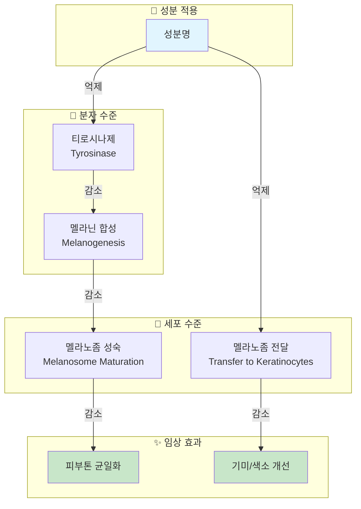
```mermaid
graph TD
    subgraph Input["🧴 성분 적용"]
        A[성분명]
    end

    subgraph Molecular["🔬 분자 수준"]
        B[티로시나제<br>Tyrosinase]
        C[멜라닌 합성<br>Melanogenesis]
    end

    subgraph Cellular["🔴 세포 수준"]
        D[멜라노좀 성숙<br>Melanosome Maturation]
        E[멜라노좀 전달<br>Transfer to Keratinocytes]
    end

    subgraph Clinical["✨ 임상 효과"]
        F[피부톤 균일화]
        G[기미/색소 개선]
    end

    A -->|억제| B
    B -->|감소| C
    C -->|감소| D
    A -->|억제| E
    D -->|감소| F
    E -->|감소| G

    style A fill:#e1f5fe
    style F fill:#c8e6c9
    style G fill:#c8e6c9
```

### 템플릿 2: 항노화 메커니즘 (콜라겐 합성)

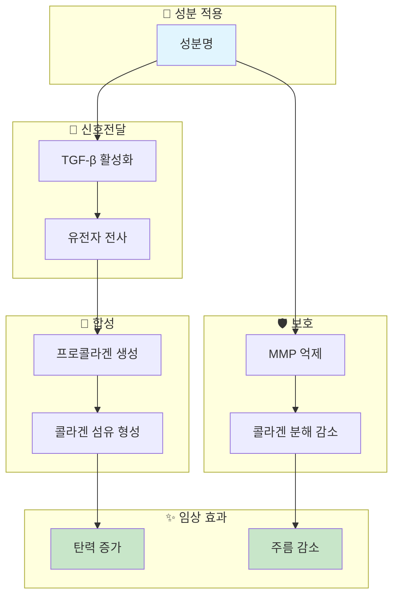
```mermaid
graph TD
    subgraph Input["🧴 성분 적용"]
        A[성분명]
    end

    subgraph Signaling["📡 신호전달"]
        B[TGF-β 활성화]
        C[유전자 전사]
    end

    subgraph Synthesis["🔧 합성"]
        D[프로콜라겐 생성]
        E[콜라겐 섬유 형성]
    end

    subgraph Protection["🛡️ 보호"]
        F[MMP 억제]
        G[콜라겐 분해 감소]
    end

    subgraph Clinical["✨ 임상 효과"]
        H[탄력 증가]
        I[주름 감소]
    end

    A --> B
    B --> C
    C --> D
    D --> E
    A --> F
    F --> G
    E --> H
    G --> I

    style A fill:#e1f5fe
    style H fill:#c8e6c9
    style I fill:#c8e6c9
```

### 템플릿 3: 항산화 메커니즘

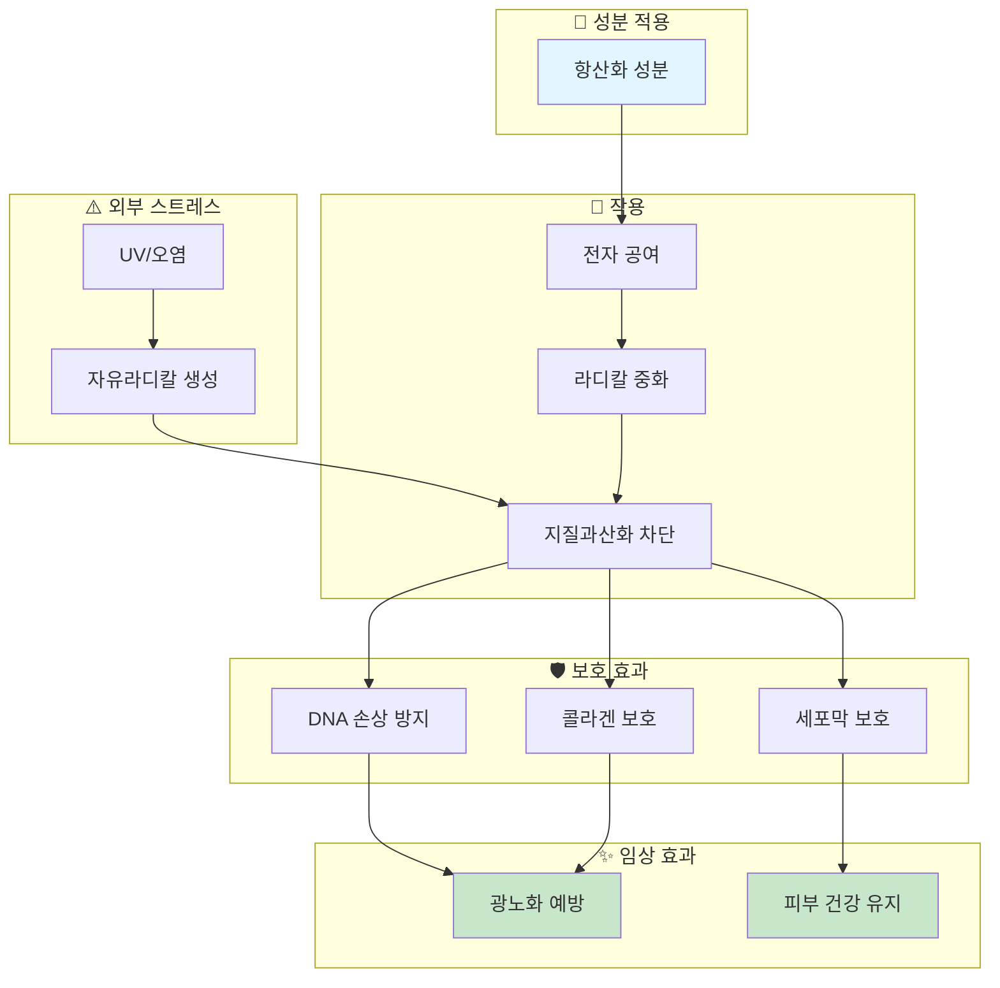
```mermaid
graph TD
    subgraph External["⚠️ 외부 스트레스"]
        X[UV/오염]
        Y[자유라디칼 생성]
    end

    subgraph Input["🧴 성분 적용"]
        A[항산화 성분]
    end

    subgraph Action["🔬 작용"]
        B[전자 공여]
        C[라디칼 중화]
        D[지질과산화 차단]
    end

    subgraph Protection["🛡️ 보호 효과"]
        E[DNA 손상 방지]
        F[콜라겐 보호]
        G[세포막 보호]
    end

    subgraph Clinical["✨ 임상 효과"]
        H[광노화 예방]
        I[피부 건강 유지]
    end

    X --> Y
    Y --> D
    A --> B
    B --> C
    C --> D
    D --> E
    D --> F
    D --> G
    E --> H
    F --> H
    G --> I

    style A fill:#e1f5fe
    style H fill:#c8e6c9
    style I fill:#c8e6c9
```

### 템플릿 4: 보습/장벽 메커니즘

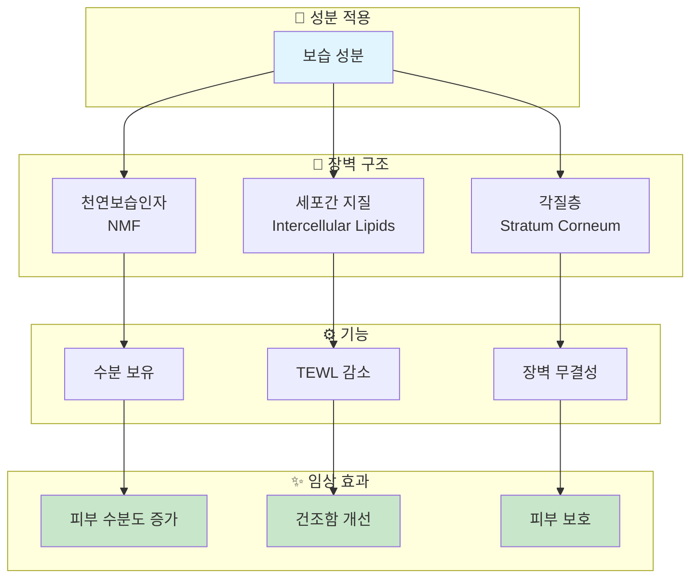
```mermaid
graph TD
    subgraph Input["🧴 성분 적용"]
        A[보습 성분]
    end

    subgraph Barrier["🧱 장벽 구조"]
        B[각질층<br>Stratum Corneum]
        C[세포간 지질<br>Intercellular Lipids]
        D[천연보습인자<br>NMF]
    end

    subgraph Function["⚙️ 기능"]
        E[수분 보유]
        F[TEWL 감소]
        G[장벽 무결성]
    end

    subgraph Clinical["✨ 임상 효과"]
        H[피부 수분도 증가]
        I[건조함 개선]
        J[피부 보호]
    end

    A --> B
    A --> C
    A --> D
    B --> G
    C --> F
    D --> E
    E --> H
    F --> I
    G --> J

    style A fill:#e1f5fe
    style H fill:#c8e6c9
    style I fill:#c8e6c9
    style J fill:#c8e6c9
```

### 템플릿 5: 항염/진정 메커니즘

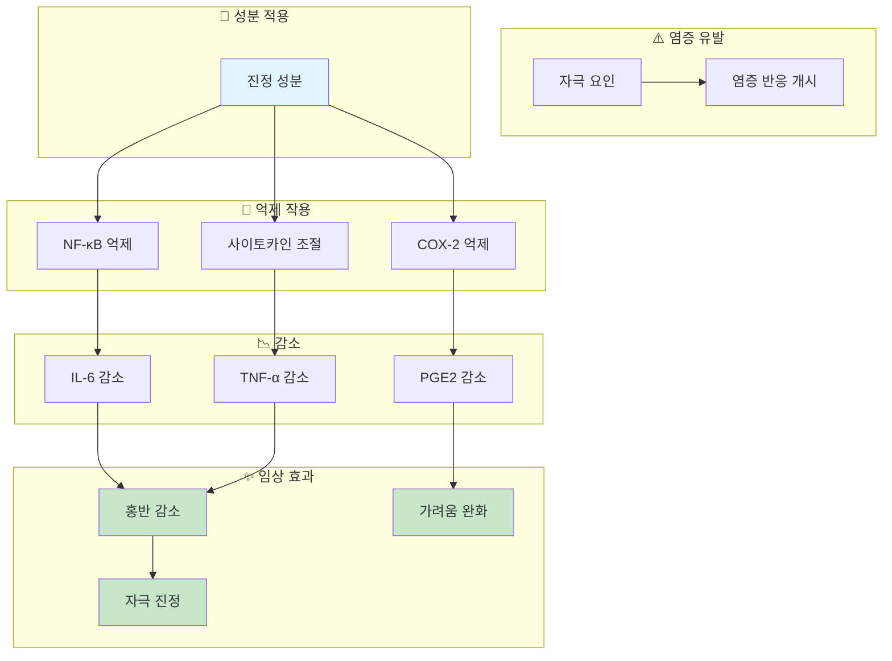
```mermaid
graph TD
    subgraph Trigger["⚠️ 염증 유발"]
        X[자극 요인]
        Y[염증 반응 개시]
    end

    subgraph Input["🧴 성분 적용"]
        A[진정 성분]
    end

    subgraph Inhibition["🚫 억제 작용"]
        B[NF-κB 억제]
        C[COX-2 억제]
        D[사이토카인 조절]
    end

    subgraph Reduction["📉 감소"]
        E[IL-6 감소]
        F[TNF-α 감소]
        G[PGE2 감소]
    end

    subgraph Clinical["✨ 임상 효과"]
        H[홍반 감소]
        I[가려움 완화]
        J[자극 진정]
    end

    X --> Y
    A --> B
    A --> C
    A --> D
    B --> E
    C --> G
    D --> F
    E --> H
    F --> H
    G --> I
    H --> J

    style A fill:#e1f5fe
    style H fill:#c8e6c9
    style I fill:#c8e6c9
    style J fill:#c8e6c9
```

### 템플릿 6: 레티노이드 신호전달

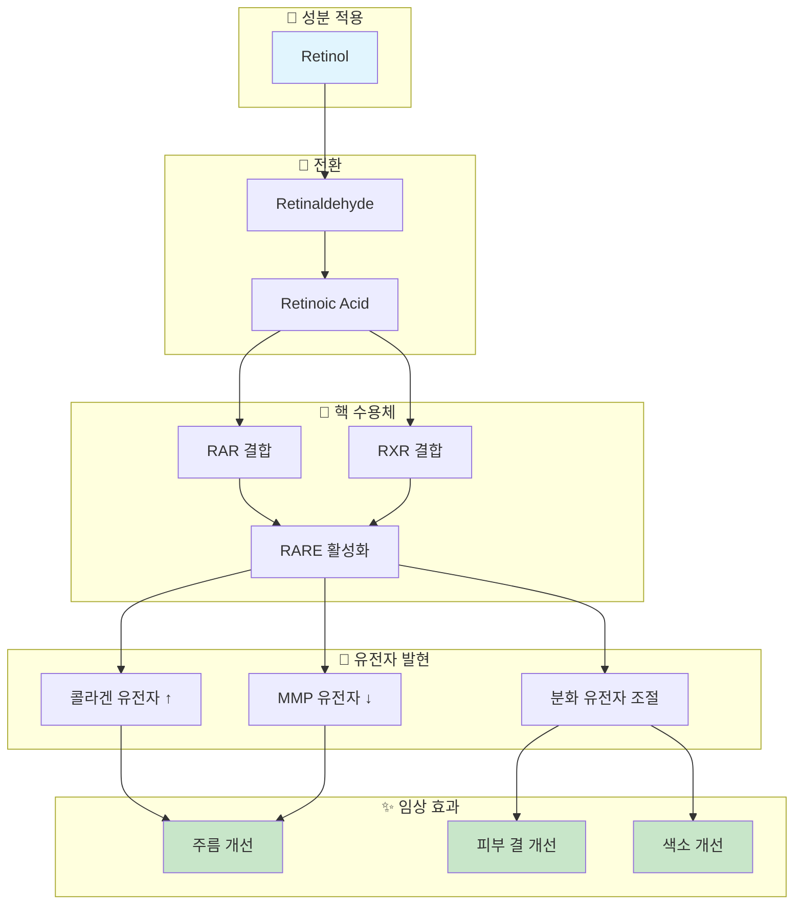
```mermaid
graph TD
    subgraph Input["🧴 성분 적용"]
        A[Retinol]
    end

    subgraph Conversion["🔄 전환"]
        B[Retinaldehyde]
        C[Retinoic Acid]
    end

    subgraph Nuclear["🔵 핵 수용체"]
        D[RAR 결합]
        E[RXR 결합]
        F[RARE 활성화]
    end

    subgraph Gene["🧬 유전자 발현"]
        G[콜라겐 유전자 ↑]
        H[MMP 유전자 ↓]
        I[분화 유전자 조절]
    end

    subgraph Clinical["✨ 임상 효과"]
        J[주름 개선]
        K[피부 결 개선]
        L[색소 개선]
    end

    A --> B
    B --> C
    C --> D
    C --> E
    D --> F
    E --> F
    F --> G
    F --> H
    F --> I
    G --> J
    H --> J
    I --> K
    I --> L

    style A fill:#e1f5fe
    style J fill:#c8e6c9
    style K fill:#c8e6c9
    style L fill:#c8e6c9
```

### 템플릿 7: NAD+ 대사 (Niacinamide)

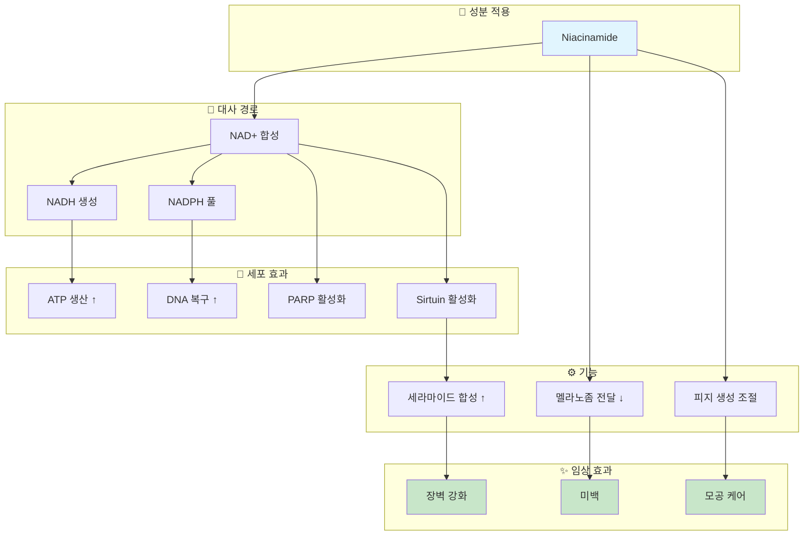
```mermaid
graph TD
    subgraph Input["🧴 성분 적용"]
        A[Niacinamide]
    end

    subgraph Metabolism["🔄 대사 경로"]
        B[NAD+ 합성]
        C[NADH 생성]
        D[NADPH 풀]
    end

    subgraph Cellular["🔴 세포 효과"]
        E[ATP 생산 ↑]
        F[DNA 복구 ↑]
        G[PARP 활성화]
        H[Sirtuin 활성화]
    end

    subgraph Functions["⚙️ 기능"]
        I[세라마이드 합성 ↑]
        J[멜라노좀 전달 ↓]
        K[피지 생성 조절]
    end

    subgraph Clinical["✨ 임상 효과"]
        L[장벽 강화]
        M[미백]
        N[모공 케어]
    end

    A --> B
    B --> C
    B --> D
    C --> E
    D --> F
    B --> G
    B --> H
    H --> I
    A --> J
    A --> K
    I --> L
    J --> M
    K --> N

    style A fill:#e1f5fe
    style L fill:#c8e6c9
    style M fill:#c8e6c9
    style N fill:#c8e6c9
```

### 템플릿 8: 펩타이드 신호전달

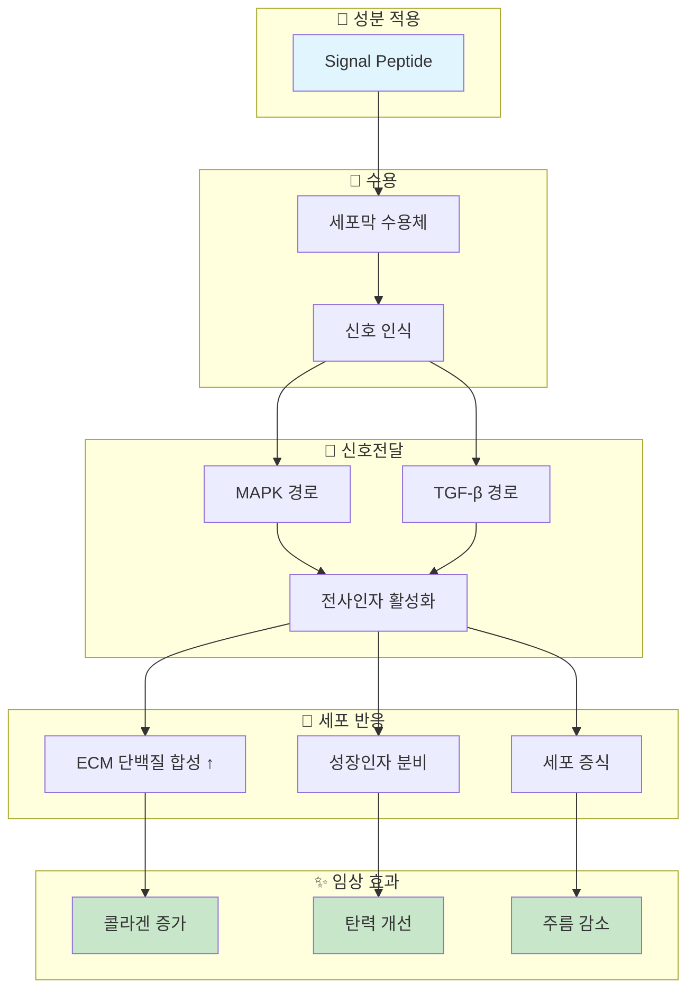
```mermaid
graph TD
    subgraph Input["🧴 성분 적용"]
        A[Signal Peptide]
    end

    subgraph Reception["📡 수용"]
        B[세포막 수용체]
        C[신호 인식]
    end

    subgraph Signaling["🔀 신호전달"]
        D[MAPK 경로]
        E[TGF-β 경로]
        F[전사인자 활성화]
    end

    subgraph Response["🔧 세포 반응"]
        G[ECM 단백질 합성 ↑]
        H[성장인자 분비]
        I[세포 증식]
    end

    subgraph Clinical["✨ 임상 효과"]
        J[콜라겐 증가]
        K[탄력 개선]
        L[주름 감소]
    end

    A --> B
    B --> C
    C --> D
    C --> E
    D --> F
    E --> F
    F --> G
    F --> H
    F --> I
    G --> J
    H --> K
    I --> L

    style A fill:#e1f5fe
    style J fill:#c8e6c9
    style K fill:#c8e6c9
    style L fill:#c8e6c9
```

---

## 3. 성분별 메커니즘 상세

### Vitamin C (Ascorbic Acid)

#### Primary Mechanism: 항산화

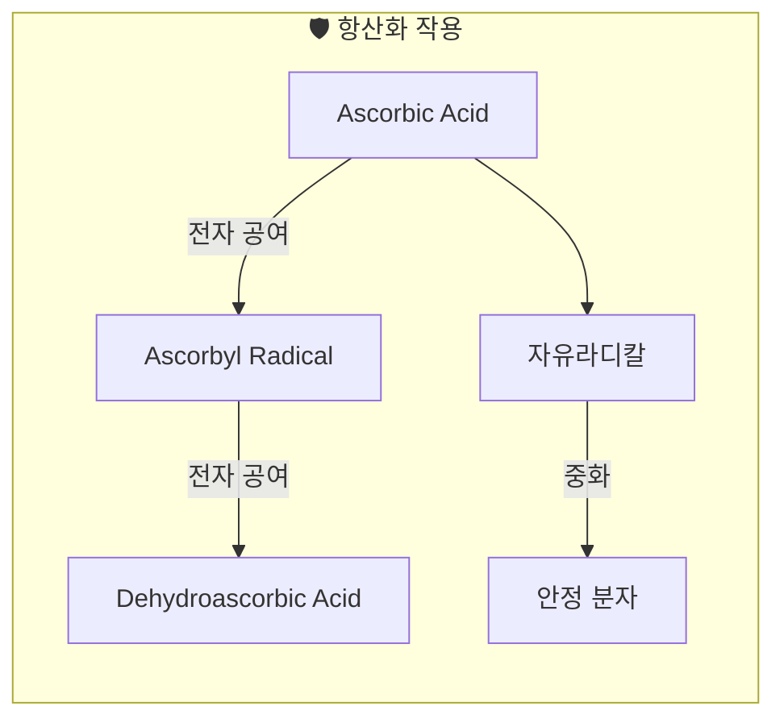
```mermaid
graph LR
    subgraph Antioxidant["🛡️ 항산화 작용"]
        A[Ascorbic Acid] -->|전자 공여| B[Ascorbyl Radical]
        B -->|전자 공여| C[Dehydroascorbic Acid]
        D[자유라디칼] -->|중화| E[안정 분자]
    end

    A --> D
```

#### Secondary Mechanism: 콜라겐 합성

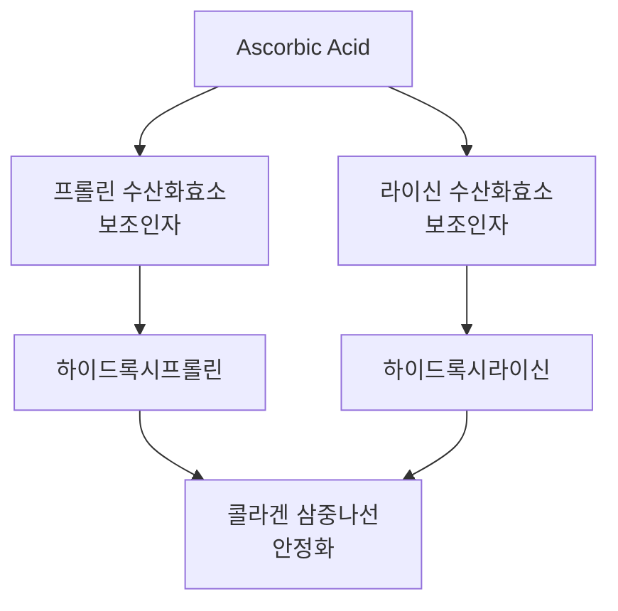
```mermaid
graph TD
    A[Ascorbic Acid] --> B[프롤린 수산화효소<br>보조인자]
    A --> C[라이신 수산화효소<br>보조인자]
    B --> D[하이드록시프롤린]
    C --> E[하이드록시라이신]
    D --> F[콜라겐 삼중나선<br>안정화]
    E --> F
```

#### Tertiary Mechanism: 미백

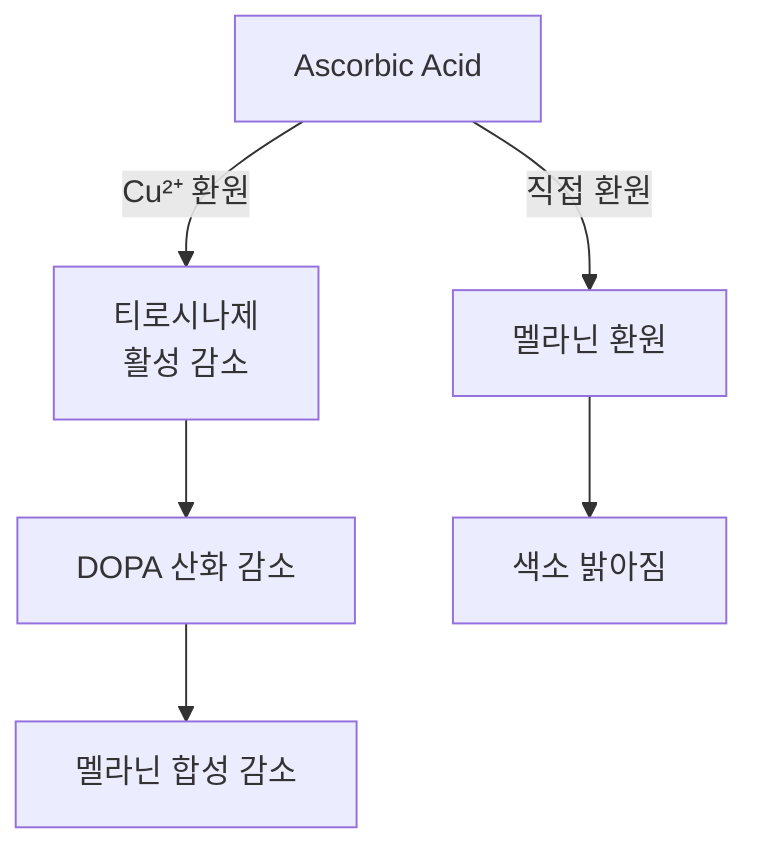
```mermaid
graph TD
    A[Ascorbic Acid] -->|Cu²⁺ 환원| B[티로시나제<br>활성 감소]
    B --> C[DOPA 산화 감소]
    C --> D[멜라닌 합성 감소]
    A -->|직접 환원| E[멜라닌 환원]
    E --> F[색소 밝아짐]
```

---

### Niacinamide

#### Primary Mechanism: NAD+ 대사

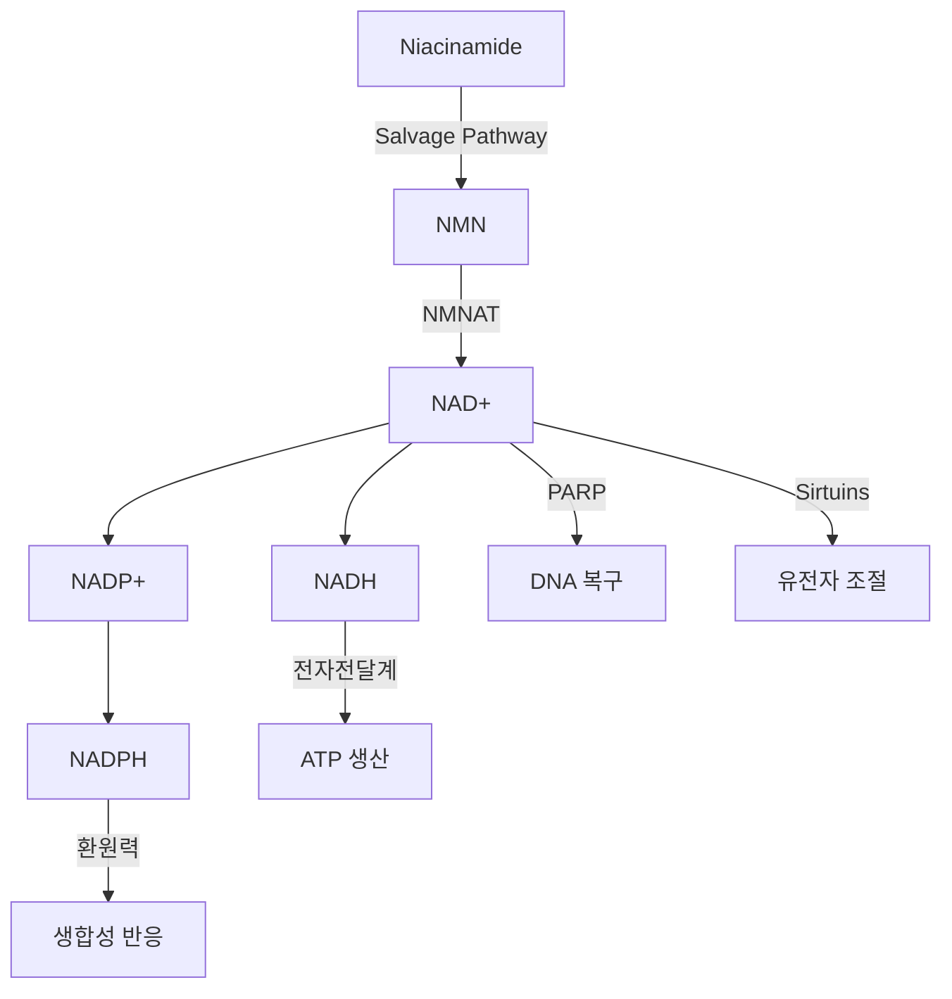
```mermaid
graph TD
    A[Niacinamide] -->|Salvage Pathway| B[NMN]
    B -->|NMNAT| C[NAD+]
    C --> D[NADH]
    C --> E[NADP+]
    E --> F[NADPH]

    D -->|전자전달계| G[ATP 생산]
    C -->|PARP| H[DNA 복구]
    C -->|Sirtuins| I[유전자 조절]
    F -->|환원력| J[생합성 반응]
```

#### Secondary Mechanism: 장벽 강화

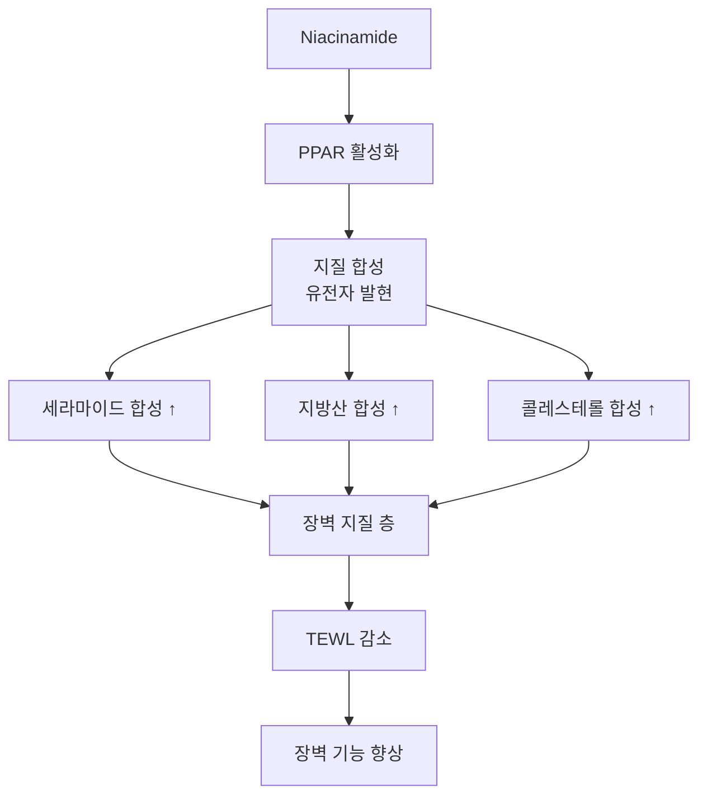
```mermaid
graph TD
    A[Niacinamide] --> B[PPAR 활성화]
    B --> C[지질 합성<br>유전자 발현]
    C --> D[세라마이드 합성 ↑]
    C --> E[지방산 합성 ↑]
    C --> F[콜레스테롤 합성 ↑]
    D --> G[장벽 지질 층]
    E --> G
    F --> G
    G --> H[TEWL 감소]
    H --> I[장벽 기능 향상]
```

---

### Retinol

#### Complete Mechanism Pathway

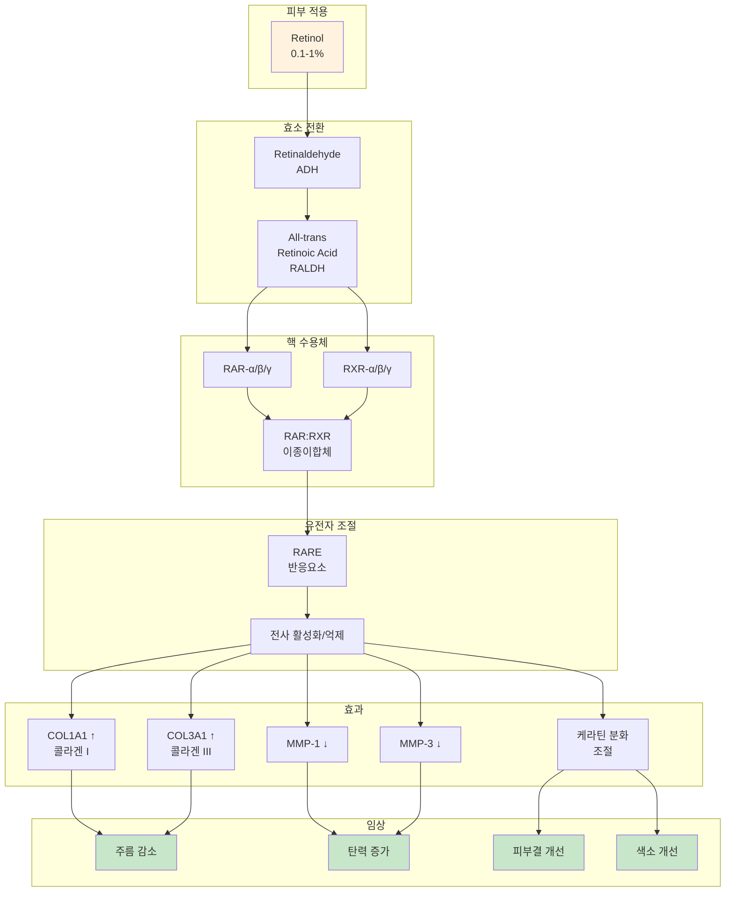
```mermaid
graph TD
    subgraph Topical["피부 적용"]
        A[Retinol<br>0.1-1%]
    end

    subgraph Conversion["효소 전환"]
        B[Retinaldehyde<br>ADH]
        C[All-trans<br>Retinoic Acid<br>RALDH]
    end

    subgraph Nuclear["핵 수용체"]
        D[RAR-α/β/γ]
        E[RXR-α/β/γ]
        F[RAR:RXR<br>이종이합체]
    end

    subgraph DNA["유전자 조절"]
        G[RARE<br>반응요소]
        H[전사 활성화/억제]
    end

    subgraph Effects["효과"]
        I[COL1A1 ↑<br>콜라겐 I]
        J[COL3A1 ↑<br>콜라겐 III]
        K[MMP-1 ↓]
        L[MMP-3 ↓]
        M[케라틴 분화<br>조절]
    end

    subgraph Clinical["임상"]
        N[주름 감소]
        O[탄력 증가]
        P[피부결 개선]
        Q[색소 개선]
    end

    A --> B
    B --> C
    C --> D
    C --> E
    D --> F
    E --> F
    F --> G
    G --> H
    H --> I
    H --> J
    H --> K
    H --> L
    H --> M
    I --> N
    J --> N
    K --> O
    L --> O
    M --> P
    M --> Q

    style A fill:#fff3e0
    style N fill:#c8e6c9
    style O fill:#c8e6c9
    style P fill:#c8e6c9
    style Q fill:#c8e6c9
```

---

### Hyaluronic Acid

#### 분자량별 메커니즘

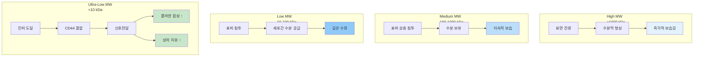
```mermaid
graph TD
    subgraph HMW["High MW<br>>1000 kDa"]
        A1[표면 잔류] --> B1[수분막 형성]
        B1 --> C1[즉각적 보습감]
    end

    subgraph MMW["Medium MW<br>100-1000 kDa"]
        A2[표피 상층 침투] --> B2[수분 보유]
        B2 --> C2[지속적 보습]
    end

    subgraph LMW["Low MW<br>10-100 kDa"]
        A3[표피 침투] --> B3[세포간 수분 공급]
        B3 --> C3[깊은 수화]
    end

    subgraph ULMW["Ultra-Low MW<br><10 kDa"]
        A4[진피 도달] --> B4[CD44 결합]
        B4 --> C4[신호전달]
        C4 --> D4[콜라겐 합성 ↑]
        C4 --> E4[상처 치유 ↑]
    end

    style C1 fill:#e3f2fd
    style C2 fill:#bbdefb
    style C3 fill:#90caf9
    style D4 fill:#c8e6c9
    style E4 fill:#c8e6c9
```

---

## 4. 메커니즘 작성 가이드라인

### 구조화 원칙

1. **입력 → 과정 → 출력** 흐름 유지
2. **분자 → 세포 → 조직 → 임상** 수준 progression
3. **주요 경로와 부수 경로** 구분
4. **시각적 계층** 활용 (subgraph)

### 다이어그램 스타일 가이드

```
노드 색상:
- 성분 입력: #e1f5fe (연한 파랑)
- 중간 과정: 기본 (흰색)
- 최종 효과: #c8e6c9 (연한 녹색)
- 억제/감소: #ffcdd2 (연한 빨강)
- 활성화/증가: #dcedc8 (연한 라임)

화살표 스타일:
- 일반 전환: -->
- 억제: --|억제|
- 활성화: -->|활성화|
- 전환: -->|enzyme|
```

### 템플릿 선택 가이드

| 성분 유형 | 권장 템플릿 |
|----------|------------|
| 미백 성분 | 템플릿 1 (미백 메커니즘) |
| 항노화 성분 | 템플릿 2 (콜라겐) + 템플릿 3 (항산화) |
| 비타민 유도체 | 템플릿 6 (레티노이드) 또는 템플릿 7 (NAD+) |
| 펩타이드 | 템플릿 8 (펩타이드 신호전달) |
| 보습 성분 | 템플릿 4 (장벽) |
| 진정 성분 | 템플릿 5 (항염) |

---

## 5. 참고 자료

- Molecular Biology of the Cell (Alberts et al.)
- Fitzpatrick's Dermatology
- Cosmeceuticals and Cosmetic Practice (Draelos)
- Journal of Investigative Dermatology
- Journal of Cosmetic Dermatology
