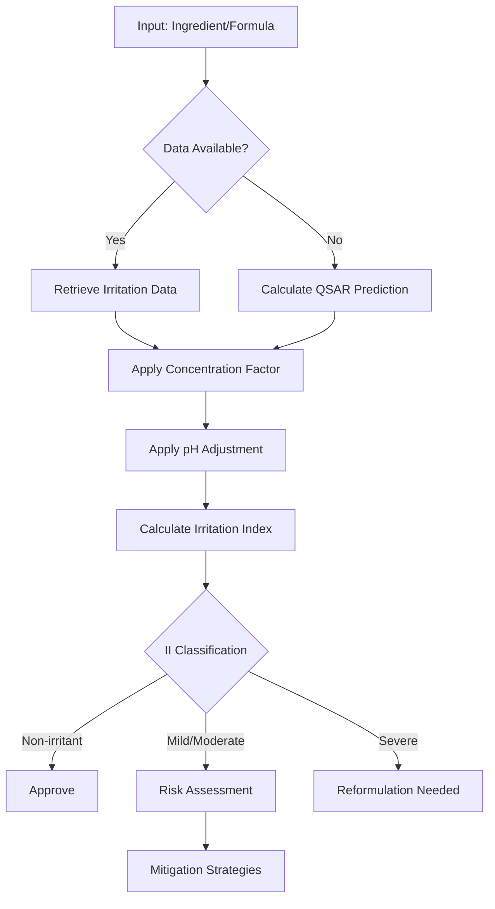

# Irritation Predictor Skill

A comprehensive skill for predicting skin irritation potential of cosmetic ingredients and formulations using molecular descriptors, QSAR models, and regulatory-accepted in vitro test methods.

## Overview

Skin irritation is a critical safety endpoint in cosmetic development. This skill provides tools and knowledge for:

1. **In Silico Prediction**: QSAR-based irritation estimation using molecular properties
2. **Molecular Descriptor Analysis**: LogP, molecular weight, pKa, and their relationship to irritation
3. **Surfactant Assessment**: Critical micelle concentration and protein denaturation potential
4. **In Vitro Testing**: 3D reconstructed human skin models (RhE) per OECD TG 439
5. **Regulatory Compliance**: EU Cosmetics Regulation and global regulatory requirements

## Key Concepts

### Irritation Mechanisms

Skin irritation occurs through multiple pathways:

- **Barrier Disruption**: Damage to stratum corneum lipids and proteins
- **Cellular Cytotoxicity**: Direct damage to keratinocytes
- **Inflammatory Response**: Release of pro-inflammatory cytokines (IL-1α, IL-8)
- **Protein Denaturation**: Unfolding of structural proteins

### Molecular Predictors

Key molecular properties influencing irritation:

| Property | Irritation Relationship | Threshold |
|----------|------------------------|-----------|
| LogP | Higher LogP = greater membrane penetration | LogP > 3.5 = concern |
| Molecular Weight | Lower MW = easier penetration | MW < 500 Da = penetrant |
| pKa | Affects ionization state | Extremes (< 4 or > 10) = concern |
| Water Solubility | Affects bioavailability | Moderate = optimal |

### Irritation Index Calculation

The Irritation Index (II) provides a quantitative estimate:

```
II = Σ(Ci × IPi × AFi) / 100

Where:
- Ci = Concentration of ingredient i (%)
- IPi = Irritation Potential score (0-100)
- AFi = Adjustment Factor (pH, vehicle effects)
```

### Classification Categories

| Category | Irritation Index | Description |
|----------|-----------------|-------------|
| Non-irritant | II < 0.5 | Safe for general use |
| Mild irritant | 0.5 ≤ II < 2.0 | Safe with precautions |
| Moderate irritant | 2.0 ≤ II < 5.0 | Requires risk assessment |
| Severe irritant | II ≥ 5.0 | Not recommended |

## Usage Examples

### Example 1: Single Ingredient Assessment

```
User: Assess the irritation potential of Sodium Lauryl Sulfate at 2%

Response should include:
- Molecular properties (LogP, MW, CMC)
- Historical irritation data
- In silico prediction score
- Recommended concentration limits
- Alternative surfactants if needed
```

### Example 2: Formulation Screening

```
User: Calculate irritation index for this cleanser:
- Sodium Laureth Sulfate: 12%
- Cocamidopropyl Betaine: 4%
- Sodium Cocoyl Isethionate: 2%
- pH: 5.5

Response should include:
- Individual ingredient scores
- Synergistic/antagonistic effects
- Total Irritation Index
- Risk classification
- Optimization recommendations
```

### Example 3: pH Optimization

```
User: How does pH affect the irritation potential of glycolic acid at 10%?

Response should include:
- pKa of glycolic acid
- Free acid percentage at various pH
- Irritation potential curve
- Optimal pH range for efficacy vs. safety
```

## Workflow



## Integration Points

### With Other Skills

- **formulation-optimizer**: Adjust formulations based on irritation predictions
- **ingredient-compatibility**: Check irritation synergies between ingredients
- **regulatory-compliance**: Ensure formulations meet regional irritation standards
- **claim-substantiation**: Support mildness claims with data

### Data Sources

- CIR (Cosmetic Ingredient Review) safety assessments
- SCCS (Scientific Committee on Consumer Safety) opinions
- ECHA (European Chemicals Agency) database
- Published in vitro test results

## References

See the `references/` directory for detailed documentation:

- `irritation_mechanisms.md`: Detailed skin irritation biology
- `prediction_models.md`: QSAR and in silico methods
- `test_methods.md`: In vitro testing protocols (OECD TG 439)

## Scripts

The `scripts/` directory contains utility programs:

- `irritation_estimator.py`: Command-line tool for irritation prediction

## Regulatory Context

### EU Cosmetics Regulation (EC) No 1223/2009

- Animal testing ban requires validated in vitro alternatives
- Safety assessment must include irritation evaluation
- OECD TG 439 accepted for regulatory purposes

### OECD Test Guidelines

- **TG 439**: In Vitro Skin Irritation (RhE test method)
- **TG 431**: In Vitro Skin Corrosion
- **TG 492**: Reconstructed human Cornea-like Epithelium (Eye Irritation)

### Global Considerations

| Region | Requirement | Accepted Methods |
|--------|-------------|------------------|
| EU | Mandatory in vitro | OECD TG 439 |
| China | Transitioning | OECD methods accepted |
| US | Risk-based | OECD or validated alternatives |
| Japan | Case-by-case | OECD methods preferred |

## Best Practices

1. **Start with in silico screening** to prioritize testing
2. **Consider vehicle effects** - irritation depends on formulation context
3. **Account for concentration** - dose-response is critical
4. **Validate predictions** with in vitro testing when possible
5. **Document risk assessment** for regulatory submissions

## Limitations

- QSAR predictions are estimates; validation recommended
- Sensitization is distinct from irritation (see sensitization-predictor skill)
- Individual variation exists; population-based assessments are averages
- Some ingredients lack sufficient data for accurate prediction

## Version History

- **1.0.0** (2024-01): Initial release with core prediction capabilities
