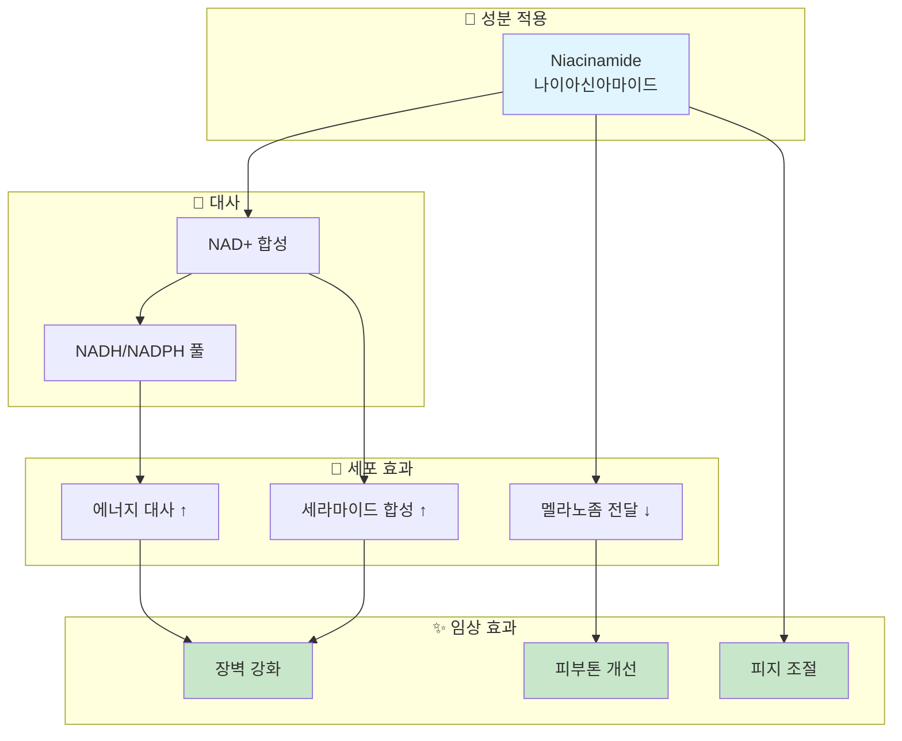

# Mechanism Diagram Generator Skill

화장품 성분의 작용 메커니즘을 전문적인 Mermaid 다이어그램으로 생성하는 스킬

## Overview

**Mechanism Diagram Generator**는 화장품 활성 성분의 생물학적/화학적 작용 기전을 시각적으로 표현하는 Mermaid 다이어그램을 자동 생성합니다. K-Dense 수준의 기술 보고서에 삽입할 수 있는 전문적인 품질의 다이어그램을 제공합니다.

### 주요 특징

- **다양한 다이어그램 유형**: Flowchart, Sequence, State diagram 지원
- **효능별 템플릿**: 미백, 항노화, 보습, 진정 등 효능별 최적화 템플릿
- **다국어 지원**: 한국어/영어 라벨 생성
- **스타일 커스터마이징**: 색상, 크기, 형태 조정 가능
- **SVG/PNG 내보내기**: 외부 렌더링 지원

## When to Use This Skill

이 스킬은 다음과 같은 상황에서 사용합니다:

- **기술 보고서 작성**: 성분 작용 기전 시각화
- **마케팅 자료**: 과학적 근거 기반 인포그래픽
- **교육 자료**: 성분 메커니즘 교육용 다이어그램
- **원료 평가**: 원료 특성 비교 시각화
- **프레젠테이션**: 연구 발표, 제품 설명

## Core Capabilities

### 1. 기본 다이어그램 생성

```python
from mechanism_diagram_generator import DiagramGenerator

generator = DiagramGenerator()

# 기본 메커니즘 다이어그램
diagram = generator.generate(
    ingredient="Niacinamide",
    mechanism_type="primary",  # primary, secondary, all
    output_format="mermaid"    # mermaid, svg, png
)

print(diagram.code)
```

### 2. 효능별 다이어그램

#### 미백 메커니즘
```python
# 티로시나제 억제 경로
whitening_diagram = generator.generate_whitening_pathway(
    ingredient="Arbutin",
    pathway_type="tyrosinase_inhibition"
)
```

#### 항노화 메커니즘
```python
# 콜라겐 합성 경로
antiaging_diagram = generator.generate_antiaging_pathway(
    ingredient="Retinol",
    pathway_type="collagen_synthesis"
)
```

#### 항산화 메커니즘
```python
# 항산화 네트워크
antioxidant_diagram = generator.generate_antioxidant_pathway(
    ingredient="Vitamin C",
    include_regeneration=True  # Vitamin E 재생 포함
)
```

#### 보습/장벽 메커니즘
```python
# 피부 장벽 강화 경로
barrier_diagram = generator.generate_barrier_pathway(
    ingredient="Ceramide NP",
    pathway_type="lipid_synthesis"
)
```

### 3. 다이어그램 유형

#### Flowchart (기본)
```python
diagram = generator.generate(
    ingredient="Niacinamide",
    diagram_type="flowchart",
    direction="TD"  # TB, BT, LR, RL
)
```

#### Sequence Diagram
```python
diagram = generator.generate(
    ingredient="Retinol",
    diagram_type="sequence",
    participants=["Retinol", "RAR", "Gene", "Collagen"]
)
```

#### State Diagram
```python
diagram = generator.generate(
    ingredient="Hyaluronic Acid",
    diagram_type="state",
    states=["applied", "absorbed", "bound", "effect"]
)
```

### 4. 스타일 커스터마이징

```python
# 스타일 설정
style_config = {
    "input_color": "#e1f5fe",      # 성분 입력 노드
    "process_color": "#ffffff",    # 중간 과정 노드
    "output_color": "#c8e6c9",     # 최종 효과 노드
    "inhibit_color": "#ffcdd2",    # 억제 경로
    "activate_color": "#dcedc8",   # 활성화 경로
    "font_size": "14px",
    "node_shape": "rounded"        # rounded, rect, circle, diamond
}

diagram = generator.generate(
    ingredient="Niacinamide",
    style=style_config
)
```

### 5. 언어 설정

```python
# 한국어 라벨
diagram_ko = generator.generate(
    ingredient="Niacinamide",
    language="ko"
)

# 영어 라벨
diagram_en = generator.generate(
    ingredient="Niacinamide",
    language="en"
)

# 한영 병기
diagram_dual = generator.generate(
    ingredient="Niacinamide",
    language="ko-en"
)
```

## Output Structure

### Mermaid Code 출력



### DiagramResult 객체

```python
@dataclass
class DiagramResult:
    ingredient: str
    mechanism_type: str
    diagram_type: str
    code: str              # Mermaid 코드
    language: str
    nodes: List[Node]      # 노드 목록
    edges: List[Edge]      # 연결 목록
    style: Dict            # 스타일 설정

    def to_mermaid(self) -> str:
        """Mermaid 코드 반환"""

    def to_svg(self) -> bytes:
        """SVG 바이트 반환"""

    def to_html(self) -> str:
        """HTML 임베드 코드 반환"""

    def save(self, filepath: str):
        """파일로 저장"""
```

## Pathway Templates

### 사전 정의된 경로 템플릿

| 템플릿 ID | 설명 | 주요 성분 |
|----------|------|----------|
| `tyrosinase_inhibition` | 티로시나제 억제 경로 | Arbutin, Kojic Acid |
| `melanin_transfer_block` | 멜라노좀 전달 차단 | Niacinamide |
| `collagen_synthesis` | 콜라겐 합성 촉진 | Retinol, Vitamin C |
| `mmp_inhibition` | MMP 억제 경로 | Retinol, EGCG |
| `antioxidant_network` | 항산화 네트워크 | Vitamin C, E, Ferulic |
| `nad_metabolism` | NAD+ 대사 경로 | Niacinamide |
| `retinoid_signaling` | 레티노이드 신호전달 | Retinol, Retinaldehyde |
| `barrier_lipid` | 장벽 지질 합성 | Ceramide, Niacinamide |
| `hyaluronic_hydration` | 히알루론산 수분 경로 | Sodium Hyaluronate |
| `peptide_signaling` | 펩타이드 신호전달 | Matrixyl, GHK-Cu |
| `anti_inflammatory` | 항염 경로 | Centella, Panthenol |
| `exfoliation` | 각질 제거 경로 | AHA, BHA |

### 템플릿 사용

```python
# 사전 정의된 템플릿 사용
diagram = generator.from_template(
    template_id="collagen_synthesis",
    ingredient="Retinol",
    customize={
        "concentration": "0.5%",
        "highlight_nodes": ["RAR", "Collagen I"]
    }
)
```

## Advanced Features

### 1. 다중 성분 비교

```python
# 동일 효능 성분 비교 다이어그램
comparison = generator.generate_comparison(
    ingredients=["Arbutin", "Kojic Acid", "Vitamin C"],
    efficacy="whitening",
    show_convergence=True  # 공통 경로 표시
)
```

### 2. 시너지 다이어그램

```python
# 성분 간 시너지 효과 시각화
synergy = generator.generate_synergy(
    ingredients=["Vitamin C", "Vitamin E", "Ferulic Acid"],
    synergy_type="antioxidant_network"
)
```

### 3. 시간 경과 다이어그램

```python
# 시간에 따른 효과 시각화
timeline = generator.generate_timeline(
    ingredient="Retinol",
    timepoints=["즉시", "2주", "4주", "12주"],
    effects_per_timepoint={
        "즉시": ["피부 침투"],
        "2주": ["세포 턴오버 증가"],
        "4주": ["콜라겐 합성 시작"],
        "12주": ["주름 개선 가시화"]
    }
)
```

### 4. 용량-반응 다이어그램

```python
# 농도별 효과 시각화
dose_response = generator.generate_dose_response(
    ingredient="Niacinamide",
    concentrations=["2%", "4%", "5%", "10%"],
    effects={
        "2%": ["기본 보습"],
        "4%": ["피지 조절"],
        "5%": ["미백, 장벽 강화"],
        "10%": ["강력한 효과, 자극 가능"]
    }
)
```

## Integration

### ingredient-deep-dive 연동

```python
from ingredient_deep_dive import DeepDiveGenerator
from mechanism_diagram_generator import DiagramGenerator

deep_dive = DeepDiveGenerator()
diagram_gen = DiagramGenerator()

# Deep-dive 리포트에 다이어그램 추가
report = deep_dive.generate(ingredient="Niacinamide")
diagram = diagram_gen.generate(
    ingredient="Niacinamide",
    mechanism_type="primary"
)

report.add_diagram(diagram)
```

### clinical-evidence-aggregator 연동

```python
from clinical_evidence_aggregator import EvidenceAggregator
from mechanism_diagram_generator import DiagramGenerator

aggregator = EvidenceAggregator()
diagram_gen = DiagramGenerator()

# 근거 기반 다이어그램 주석
evidence = aggregator.get_mechanism_evidence("Niacinamide")
diagram = diagram_gen.generate(
    ingredient="Niacinamide",
    annotations=evidence.key_findings
)
```

## Best Practices

### 1. 다이어그램 복잡도 관리

```
권장 사항:
- 노드 수: 최대 15-20개
- 깊이 수준: 3-5단계
- Subgraph: 3-5개 그룹
- 연결 수: 노드 수의 1.2-1.5배
```

### 2. 라벨 가이드라인

```
- 간결하게 (3-5단어)
- 전문 용어 + 괄호 설명
- 일관된 명명 규칙
- 약어 최소화
```

### 3. 색상 사용

```
- 의미 있는 색상 사용
- 색맹 친화적 팔레트
- 고대비 유지
- 3-5가지 색상으로 제한
```

## Reference Files

| File | Description |
|------|-------------|
| [references/pathway_templates.md](references/pathway_templates.md) | 경로 템플릿 전체 목록 |
| [references/style_guide.md](references/style_guide.md) | 스타일 가이드 |
| [scripts/mechanism_diagram_generator.py](scripts/mechanism_diagram_generator.py) | Python 생성기 |

## Usage Examples

### 기본 사용
```
"나이아신아마이드 메커니즘 다이어그램 만들어줘"
→ [NAD+ 대사 경로 + 미백 경로 Mermaid 코드]
```

### 특정 경로 지정
```
"레티놀의 콜라겐 합성 촉진 메커니즘 다이어그램"
→ [레티노이드 신호전달 → 콜라겐 합성 경로]
```

### 비교 다이어그램
```
"비타민C와 아르부틴의 미백 메커니즘 비교 다이어그램"
→ [두 성분의 티로시나제 억제 경로 비교]
```

## Version History

| Version | Date | Changes |
|---------|------|---------|
| 1.0.0 | 2026-01-16 | Initial release |
