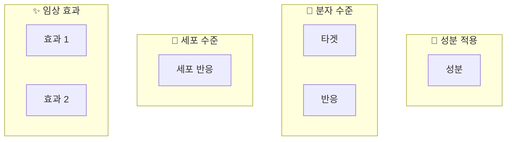
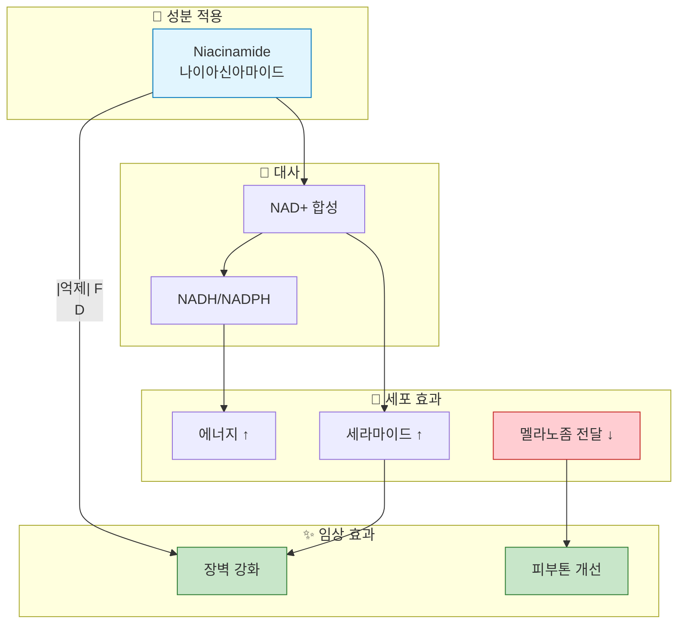
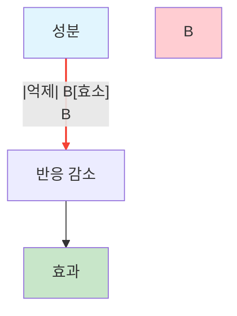

# 메커니즘 다이어그램 스타일 가이드

K-Dense 수준의 전문적인 다이어그램을 위한 스타일 가이드라인

## 1. 색상 팔레트

### 기본 색상

| 용도 | HEX 코드 | 설명 |
|-----|----------|------|
| Input (성분) | `#e1f5fe` | 연한 파랑 - 시작점 강조 |
| Process (과정) | `#ffffff` | 흰색 - 중립적 |
| Output (효과) | `#c8e6c9` | 연한 녹색 - 긍정적 결과 |
| Inhibit (억제) | `#ffcdd2` | 연한 빨강 - 부정적/억제 |
| Activate (활성) | `#dcedc8` | 연한 라임 - 활성화 |
| Highlight | `#fff9c4` | 연한 노랑 - 강조 |

### 효능별 색상 테마

#### 미백 (Whitening)
```
Input:    #e3f2fd (연한 파랑)
Process:  #ffffff
Melanin:  #8d6e63 (갈색 - 멜라닌)
Output:   #fce4ec (연한 핑크 - 밝아짐)
```

#### 항노화 (Anti-aging)
```
Input:    #f3e5f5 (연한 보라)
Process:  #ffffff
Collagen: #ffcc80 (살구색)
Output:   #e8f5e9 (연한 녹색)
```

#### 항산화 (Antioxidant)
```
Input:    #fff3e0 (연한 오렌지)
Stress:   #ffcdd2 (연한 빨강)
Protection: #c8e6c9 (연한 녹색)
Output:   #e8f5e9
```

#### 보습 (Moisturizing)
```
Input:    #e0f7fa (연한 시안)
Barrier:  #b3e5fc (하늘색)
Output:   #b2ebf2 (민트)
```

#### 진정 (Soothing)
```
Input:    #e8f5e9 (연한 녹색)
Inflammation: #ffcdd2 (연한 빨강)
Output:   #f1f8e9 (연한 라임)
```

### 색맹 친화적 팔레트

```
Blue:    #2196f3
Orange:  #ff9800
Green:   #4caf50
Purple:  #9c27b0
```

---

## 2. 노드 형태

### 기본 형태

| 형태 | Mermaid 문법 | 용도 |
|-----|-------------|------|
| 둥근 사각형 | `[텍스트]` | 일반 노드 (기본값) |
| 사각형 | `[[텍스트]]` | 구조적 요소 |
| 원형 | `((텍스트))` | 분자/성분 |
| 다이아몬드 | `{텍스트}` | 결정 포인트 |
| 육각형 | `{{텍스트}}` | 효소/수용체 |
| 스타디움 | `([텍스트])` | 시작/종료 |
| 데이터베이스 | `[(텍스트)]` | 저장소/풀 |

### 노드 유형별 권장 형태

| 노드 유형 | 권장 형태 | 예시 |
|----------|----------|------|
| 성분 입력 | 둥근 사각형 | `[Niacinamide]` |
| 효소 | 육각형 | `{{Tyrosinase}}` |
| 수용체 | 육각형 | `{{RAR}}` |
| 중간 물질 | 원형 | `((NAD+))` |
| 세포 반응 | 둥근 사각형 | `[콜라겐 합성 ↑]` |
| 임상 효과 | 스타디움 | `([주름 감소])` |

---

## 3. 연결 스타일

### 기본 연결

| 유형 | Mermaid 문법 | 용도 |
|-----|-------------|------|
| 일반 화살표 | `-->` | 기본 전환/활성화 |
| 점선 화살표 | `-.->` | 간접 효과 |
| 두꺼운 화살표 | `==>` | 주요 경로 강조 |
| 억제 | `--|억제|` | 억제 표시 |
| 양방향 | `<-->` | 상호작용 |

### 라벨 사용

```mermaid
A -->|활성화| B
A --|억제| B
A -->|전환| B
A -.->|간접 영향| B
```

### 권장 연결 표현

| 관계 | 표현 방식 |
|-----|----------|
| 활성화 | `-->` 또는 `-->|활성화|` |
| 억제 | `--|억제|` (빨간 스타일) |
| 증가 | `-->|↑|` |
| 감소 | `-->|↓|` |
| 전환 | `-->|효소명|` |
| 촉진 | `-->|촉진|` |

---

## 4. 서브그래프 구조

### 표준 레이아웃



### 서브그래프 아이콘

| 카테고리 | 아이콘 | 한국어 | 영어 |
|---------|-------|--------|-----|
| 입력 | 🧴 | 성분 적용 | Ingredient Application |
| 분자 | 🔬 | 분자 수준 | Molecular Level |
| 효소 | ⚗️ | 효소 작용 | Enzyme Action |
| 세포 | 🔴 | 세포 수준 | Cellular Level |
| 신호 | 📡 | 신호전달 | Signal Transduction |
| 합성 | 🔧 | 합성 | Synthesis |
| 보호 | 🛡️ | 보호 효과 | Protection |
| 대사 | 🔄 | 대사 | Metabolism |
| 유전자 | 🧬 | 유전자 발현 | Gene Expression |
| 장벽 | 🧱 | 장벽 구조 | Barrier Structure |
| 임상 | ✨ | 임상 효과 | Clinical Effects |
| 스트레스 | ⚠️ | 스트레스 | Stress |
| 억제 | 🚫 | 억제 | Inhibition |
| 감소 | 📉 | 감소 | Reduction |

---

## 5. 텍스트 스타일

### 라벨 작성 원칙

1. **간결성**: 3-5단어 이내
2. **명확성**: 전문 용어 + 설명
3. **일관성**: 동일 유형 동일 형식
4. **가독성**: 줄바꿈(`<br>`) 적절 활용

### 라벨 형식 예시

```
좋은 예:
- "티로시나제<br>Tyrosinase"
- "콜라겐 합성 ↑"
- "MMP-1 억제"

나쁜 예:
- "티로시나제 효소가 억제되어 멜라닌 생성이 감소함" (너무 김)
- "효소" (너무 모호)
- "Tyr." (너무 축약)
```

### 화살표 기호 사용

| 기호 | 의미 | 사용 예 |
|-----|------|---------|
| ↑ | 증가 | "콜라겐 합성 ↑" |
| ↓ | 감소 | "멜라닌 ↓" |
| → | 전환 | "A → B" |
| ⇒ | 결과 | "⇒ 주름 감소" |

---

## 6. 방향 설정

### 권장 방향

| 다이어그램 유형 | 권장 방향 | 이유 |
|---------------|----------|------|
| 단일 경로 | TD (위→아래) | 자연스러운 흐름 |
| 병렬 경로 | LR (왼쪽→오른쪽) | 비교 용이 |
| 순환 경로 | TD 또는 LR | 경우에 따라 |
| 복잡한 네트워크 | TD | 계층 구조 표현 |

### Mermaid 방향 옵션

```
TD: Top to Down (위에서 아래로)
TB: Top to Bottom (동일)
BT: Bottom to Top (아래에서 위로)
LR: Left to Right (왼쪽에서 오른쪽으로)
RL: Right to Left (오른쪽에서 왼쪽으로)
```

---

## 7. 복잡도 관리

### 노드 수 가이드라인

| 분석 수준 | 노드 수 | 서브그래프 | 적용 상황 |
|----------|--------|----------|----------|
| 간단 | 5-8 | 2-3 | 빠른 개요 |
| 표준 | 8-12 | 3-4 | 일반 분석 |
| 심층 | 12-20 | 4-6 | 상세 보고서 |
| 최대 | 20-25 | 5-7 | K-Dense 수준 |

### 복잡한 다이어그램 분할 전략

```
복잡한 경로 → 2-3개 다이어그램으로 분할:
1. 개요 다이어그램 (전체 흐름)
2. 상세 다이어그램 1 (특정 경로)
3. 상세 다이어그램 2 (다른 경로)
```

---

## 8. 스타일 적용 예시

### 완전한 스타일 코드



### 억제 경로 스타일



---

## 9. 렌더링 고려사항

### Mermaid 호환성

- Mermaid.js 버전: 10.x 이상 권장
- 지원 환경: GitHub, GitLab, Notion, Obsidian, VS Code

### 내보내기 형식

| 형식 | 용도 | 도구 |
|-----|------|------|
| Mermaid 코드 | 문서 임베딩 | Markdown |
| SVG | 벡터 이미지 | mermaid-cli |
| PNG | 래스터 이미지 | mermaid-cli |
| PDF | 인쇄용 | 외부 변환기 |

### mermaid-cli 사용

```bash
# 설치
npm install -g @mermaid-js/mermaid-cli

# SVG 변환
mmdc -i diagram.mmd -o diagram.svg

# PNG 변환
mmdc -i diagram.mmd -o diagram.png -b white
```

---

## 10. 체크리스트

### 다이어그램 품질 체크리스트

- [ ] 노드 수가 적절한가? (5-20개)
- [ ] 색상이 의미 있게 사용되었는가?
- [ ] 라벨이 간결하고 명확한가?
- [ ] 흐름이 논리적인가?
- [ ] 서브그래프가 의미 있게 구분되었는가?
- [ ] 억제/활성화가 명확히 구분되는가?
- [ ] 시작과 끝이 명확한가?
- [ ] 색맹 친화적인가?

### 보고서 삽입 전 확인

- [ ] 렌더링이 올바르게 되는가?
- [ ] 텍스트가 잘리지 않는가?
- [ ] 해상도가 충분한가?
- [ ] 인쇄 시 가독성이 유지되는가?
